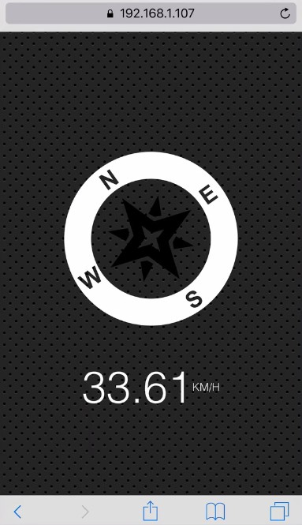

## JavaScript30 Day 21 - Geolocation based Speedometer and Compass

In this tutorial, we learn to manipulate iOS Geolocation based Speedometer and Compass. An iOS simulator is required to display the speedometer compass as shown in the screenshot below.

